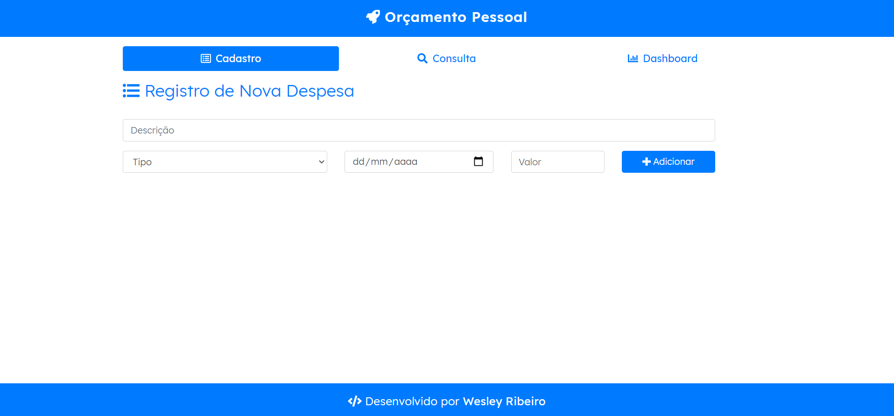
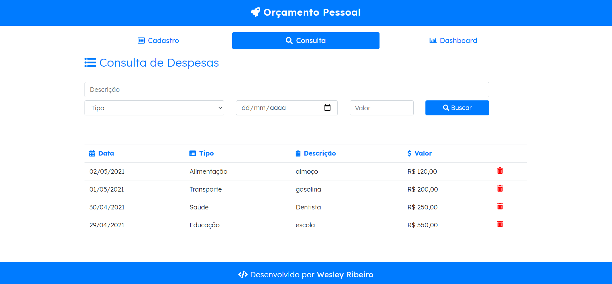
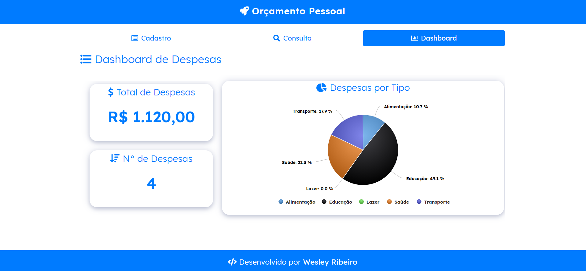

## App Orçamento Pessoal
      

## How to use
**1** - Faça um clone do repositório para sua máquina

    git clone https://github.com/wesley-rfa/app-orcamento-pessoal.git
**2** - Abra a index.html 

   ou

*Acesse*: https://wesley-rfa.github.io/app-orcamento-pessoal/

## Implementação

A ideia do projeto é colocar em prática os conhecimentos de ES6. Para isso utilizei POO, funções, arrays, filtros, LocalStorage, template String, arrow function, entre outros.

## Funcionalidades

A ideia é dividir o app em 3 abas. A de cadastro da despesa, a de consulta e um simples dashboard.

**1** - Através da aba de Cadastro é possível cadastrar uma nova despesa com as informações.

**2** - Após o cadastro a despesa é listada na tabela da aba Consulta e sua informações são processadas no dashboard.
    
**3** - Na aba Consulta é possível ver todas as despesas e filtrar de acordo com os campos desejados.

**4** - Na aba dashboard é possível ver o total de despesas, a quantidade e um gráfico feito com highCharts que mostra a distribuição de despesas por tipo em formato de pizza.

**5** - Toda persistência de dados foi feito em LocalStorage

## Exemplos

